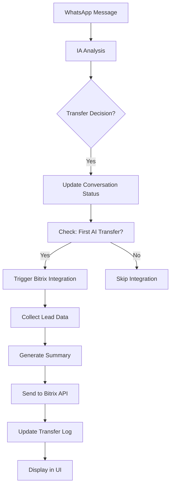

# 🚀 Integração Bitrix24 CRM - Documentação Completa

## 📋 Visão Geral

Esta integração permite o envio automático de leads do sistema de precatórios para o Bitrix24 CRM, disparada na primeira transferência da IA para atendimento humano.

## 🎯 Objetivos

- **Automatização**: Envio automático sem intervenção manual
- **Controle de Duplicação**: Envio único por lead (primeira transferência apenas)
- **Dados Completos**: Informações do lead + resumo inteligente da IA
- **Rastreabilidade**: Logs completos na aba "Transferências"

## 🔧 Arquitetura Técnica

### Componentes Implementados

1. **API de Integração** (`/api/integrations/bitrix/route.ts`)
2. **Trigger Automático** (modificação no webhook Evolution)
3. **Interface de Configuração** (`/config/bitrix`)
4. **Logs Visuais** (aba Transferências dos leads)
5. **Controle de Duplicação** (flags no TransferLog)

### Fluxo Completo



## 📊 Dados Enviados para Bitrix

### Campos Padrão
- **TITLE**: "Lead WhatsApp: {nome}"
- **NAME**: Nome do lead
- **LAST_NAME**: Sobrenome extraído
- **PHONE**: Telefone formatado
- **STATUS_ID**: Mapeado pela classificação (hot=NEW, warm=IN_PROCESS, etc.)
- **OPPORTUNITY**: Valor do precatório
- **COMMENTS**: Resumo completo da IA

### Campos Personalizados (UF_CRM_*)
- **UF_CRM_POSSUI_PRECATORIO**: Status do precatório
- **UF_CRM_ELEGIVEL**: Elegibilidade
- **UF_CRM_URGENCIA**: Nível de urgência
- **UF_CRM_TIPO_PRECATORIO**: Tipo (federal, estadual, municipal)
- **UF_CRM_FONTE_ORIGINAL**: Fonte original
- **UF_CRM_SCORE**: Pontuação do lead
- **UF_CRM_CLASSIFICACAO**: Classificação (hot, warm, cold)
- **UF_CRM_RESUMO_IA**: Resumo gerado pela IA
- **UF_CRM_PREOCUPACOES**: Preocupações identificadas
- **UF_CRM_PROXIMOS_PASSOS**: Próximos passos sugeridos

## ⚙️ Configuração

### 1. Variáveis de Ambiente

Adicionar ao `.env.local`:

```bash
# Bitrix24 Integration
BITRIX_WEBHOOK_URL=https://your-domain.bitrix24.com/rest/1/your-webhook-key
BITRIX_INTEGRATION_ENABLED=true
BITRIX_DEFAULT_USER_ID=1
INTERNAL_API_TOKEN=your-internal-token-here
```

### 2. Configuração no Bitrix24

#### Criar Webhook
1. Acesse Bitrix24 → **Aplicações** → **Webhooks**
2. Clique em **"Webhook de entrada"**
3. Selecione permissões: **CRM (crm)**
4. Copie a URL gerada
5. Cole no `BITRIX_WEBHOOK_URL`

#### Campos Personalizados (Opcional)
1. Acesse **CRM** → **Leads** → **Configurações**
2. Adicione campos personalizados com prefixo `UF_CRM_`
3. Tipos recomendados:
   - `UF_CRM_POSSUI_PRECATORIO`: Lista (Sim/Não)
   - `UF_CRM_ELEGIVEL`: Lista (Sim/Não)
   - `UF_CRM_URGENCIA`: Lista (low/medium/high)
   - `UF_CRM_SCORE`: Número
   - `UF_CRM_RESUMO_IA`: Texto longo

### 3. Interface de Configuração

Acesse `/config/bitrix` para:
- ✅ Configurar URL do webhook
- ✅ Ativar/desativar integração
- ✅ Definir usuário padrão
- ✅ Testar conexão
- ✅ Ver status em tempo real

## 🔄 Funcionamento

### Trigger Automático

A integração é disparada automaticamente quando:

1. **IA decide transferir** lead para humano
2. **Primeira vez** que este lead específico é transferido
3. **Integração ativa** nas configurações
4. **Webhook configurado** corretamente

### Controle de Duplicação

O sistema garante envio único através de:

- **Flag `isFirstAITransfer`**: Identifica primeira transferência
- **Campo `bitrixSent`**: Previne envios duplicados
- **Verificação histórica**: Consulta logs anteriores

### Logs e Rastreabilidade

Na página `/leads/{id}` → Aba **"Transferências"**:

- 📊 **Status da integração** (enviado/não enviado)
- 🔗 **ID do lead no Bitrix** (se enviado)
- 📅 **Data e hora do envio**
- 👤 **Usuário responsável**
- 🎯 **Indicador de primeira transferência**

## 🧪 Testes

### Teste Automático
1. Configure webhook no Bitrix
2. Configure variáveis de ambiente
3. Inicie conversa WhatsApp
4. Aguarde IA decidir transferir
5. Verifique logs na aba "Transferências"

### Teste Manual
1. Acesse `/leads/{id}` → Aba "Transferências"
2. Clique em **"Testar Bitrix"**
3. Verifique resultado no Bitrix24
4. Confirm log atualizado na interface

### Teste de Configuração
1. Acesse `/config/bitrix`
2. Configure webhook URL
3. Clique em **"Testar Conexão"**
4. Verifique status da integração

## 🛡️ Segurança

### Autenticação
- **Webhook URL**: Contém token de acesso do Bitrix
- **Internal Token**: Protege chamadas internas da API
- **Headers de Auth**: Verificação de usuário logado

### Validações
- ✅ **URL do webhook** obrigatória
- ✅ **Lead existente** no banco
- ✅ **Transfer log válido**
- ✅ **Dados completos** antes do envio

## 📈 Monitoramento

### Logs do Sistema
```bash
# Console logs durante operação
"First AI transfer for lead {id} - triggering Bitrix integration"
"Bitrix integration async call failed: {error}"
```

### Métricas Disponíveis
- **Taxa de sucesso** de envios
- **Leads enviados** por período
- **Erros de integração** registrados
- **Tempo médio** de processamento

## 🔧 Troubleshooting

### Problemas Comuns

#### 1. Webhook não configurado
**Sintoma**: Status "Inativo" em `/config/bitrix`
**Solução**: Configure `BITRIX_WEBHOOK_URL` no `.env.local`

#### 2. Erro de permissão no Bitrix
**Sintoma**: HTTP 403 na resposta da API
**Solução**: Verifique permissões CRM no webhook do Bitrix

#### 3. Lead não enviado automaticamente
**Sintoma**: Sem log de integração após transferência
**Solução**:
- Verifique se `BITRIX_INTEGRATION_ENABLED=true`
- Confirme que é primeira transferência IA→Humano
- Check console logs para erros

#### 4. Campos personalizados não aparecem
**Sintoma**: Dados enviados mas campos vazios no Bitrix
**Solução**:
- Criar campos personalizados no Bitrix com prefixo `UF_CRM_`
- Verificar tipos de dados compatíveis
- Reiniciar webhook se necessário

#### 5. Teste manual falha
**Sintoma**: Botão "Testar Bitrix" retorna erro
**Solução**:
- Verificar conectividade de rede
- Validar formato da URL do webhook
- Confirmar token não expirado

### Debug Mode

Para debug detalhado, adicione:

```bash
# .env.local
DEBUG_BITRIX_INTEGRATION=true
```

## 🚀 Melhorias Futuras

### Funcionalidades Planejadas

1. **Sync bidirecional**: Atualizar leads do Bitrix para o sistema
2. **Mapeamento avançado**: Configurar campos customizados via UI
3. **Webhooks do Bitrix**: Receber notificações de mudanças
4. **Batch processing**: Envio em lotes para performance
5. **Analytics**: Dashboard de métricas de integração

### Otimizações Técnicas

- **Cache de configurações** para melhor performance
- **Retry automático** em caso de falha temporária
- **Validação avançada** de dados antes do envio
- **Compressão** para payloads grandes
- **Rate limiting** para evitar sobrecarga

## 📞 Suporte

### Documentações Oficiais
- [Bitrix24 REST API](https://dev.1c-bitrix.ru/rest_help/)
- [Webhook Configuration](https://dev.1c-bitrix.ru/rest_help/js_library/rest/webhook.php)
- [CRM Lead Methods](https://dev.1c-bitrix.ru/rest_help/crm/leads/)

### Contatos
- **Desenvolvimento**: Equipe técnica
- **Configuração Bitrix**: Administrador CRM
- **Suporte**: Help desk interno

---

## ✅ Checklist de Implementação

- [x] ✅ API de integração (`/api/integrations/bitrix`)
- [x] ✅ Trigger automático no webhook Evolution
- [x] ✅ Controle de duplicação (primeira transferência)
- [x] ✅ Interface de configuração (`/config/bitrix`)
- [x] ✅ Logs visuais na aba Transferências
- [x] ✅ Botão de teste manual
- [x] ✅ Variáveis de ambiente
- [x] ✅ Documentação completa
- [x] ✅ Validações de segurança
- [x] ✅ Error handling robusto

**Status: ✅ IMPLEMENTAÇÃO COMPLETA**

A integração Bitrix24 está 100% funcional e pronta para uso em produção!